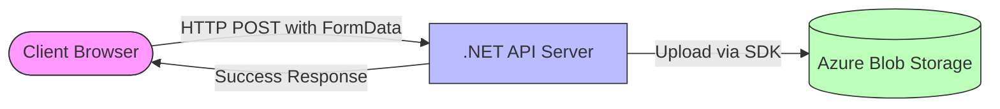
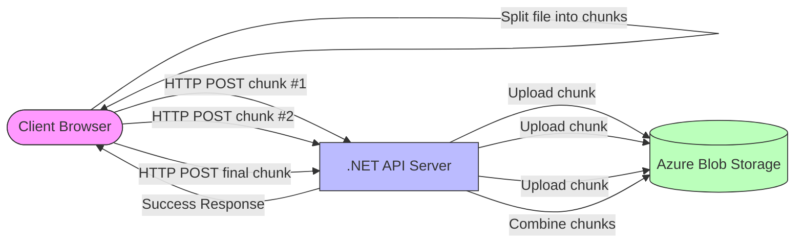
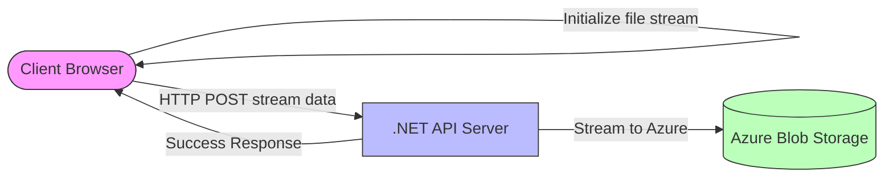
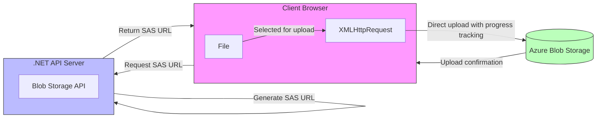
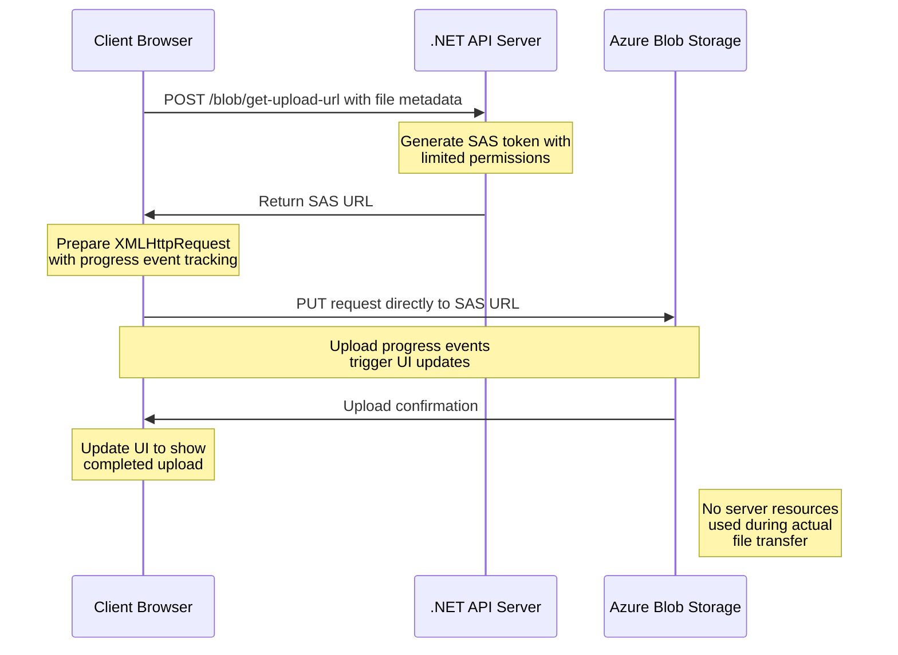

# Azure Blob Storage Example with .NET API and Angular

This repository showcases a comprehensive example of Azure Blob Storage integration using a modern tech stack:

- **Backend**: A .NET 9 API project.
- **Frontend**: An Angular 19 project with Material Design for a sleek and user-friendly interface.

It provides robust examples for handling Azure Blob Storage, including four types of file upload methods:

1. **Standard File Upload**: Upload files directly to Azure Blob Storage using a simple form data approach.
2. **Chunk Upload**: Handle large files by uploading them in smaller chunks (5MB each).
3. **Stream Upload**: Stream data directly to Azure Blob Storage for efficient memory handling.
4. **Large File Upload with SAS**: Upload directly to Azure Blob Storage using Shared Access Signatures (SAS) for optimal performance with large files.

This repository is an excellent starting point for developers looking to integrate Azure Blob Storage in their projects with modern web technologies.

## File Upload Methods
Each upload method is optimized for different scenarios and file sizes:

### Standard File Upload (uploadMultipartFormData)
- **How it works**: Uses a simple form data approach to upload entire files in a single HTTP request
- **Best for**: Small to medium-sized files and simple implementations
- **Limitations**: Not ideal for large files as everything must be loaded into memory



### Chunk-Based Upload (UploadFilesChunk)
- **How it works**: Divides files into 5MB chunks uploaded sequentially
- **Best for**: Larger files that might cause memory issues and scenarios requiring resumable uploads
- **Advantages**: Better memory management, detailed progress tracking, and resilience to connection issues



### Stream Upload (UploadFileStream)
- **How it works**: Uses JavaScript's native streaming capabilities
- **Best for**: Memory-efficient handling of any size file in modern browsers
- **Advantages**: Most memory-efficient approach, doesn't load entire file into memory



### Large File Upload with SAS (UploadLargeFile)
- **How it works**: Uses a two-step process with Shared Access Signatures for direct Azure uploads
- **Best for**: Very large files and production environments
- **Advantages**: Most scalable solution, reduces server load, best security approach for cloud storage



#### Detailed SAS Upload Process (Large Files)



### Key Differences

| Method | Direct Upload to Azure | Chunked | Client Memory | Server Memory | Progress Tracking | Resumable | Best for |
|--------|------------------------|---------|--------------|--------------|-------------------|-----------|----------|
| Standard | No | No | High | High | Simple | No | Small files |
| Chunked | No | Yes | Medium | Minimal | Detailed | Possible | Medium-large files |
| Stream | No | Implicit | Very Low | Low | Limited | No | Any size, modern browsers |
| SAS | Yes | No | Medium | Minimal | Detailed | No | Very large files in production |

---
## Features
A complete backend and frontend project structure to show case File operations (CRUD) for Azure Storage

### Backend (.NET 9 API)
- [x] **Azure Blob Storage Integration**: Includes complete implementation for uploading, downloading, and managing files.
- [ ] **Azure Table Storage Integration**: CRUD example for table records.
- [ ] **Azure File Share Integration**: Includes complete implementation for uploading, downloading, and managing files.

### Frontend (Angular 19 with Material Design)
- [x] **File Management UI**: A user-friendly interface for file upload and management.
- [x] **Multiple Upload Methods**: Implementations of all four file upload strategies with progress tracking.

### Dockerized Setup
- [ ] Docker-Compose for Multi-Container Orchestration with NGINX as Load Balancer
- [ ] Health Checks
- [ ] Docker Debug mode with hot reload for the API and UI
- [ ] Docker Production version

## Getting Started

### Prerequisites
- **Backend Requirements**:
  - .NET 9 SDK
  - Azure Storage Account with Blob Storage
  - IDE: Visual Studio or VS Code
- **Frontend Requirements**:
  - Node.js (v20 or higher)
  - Angular CLI
  - IDE: VS Code or any preferred code editor

---

### Setup Instructions

#### 1. Clone the Repository
```bash
git clone https://github.com/nitin27may/azure-storage-dotnet.git
cd azure-storage-dotnet
```

#### 2. Configure the Backend
- Navigate to the `.NET API` project folder.
- Update the `appsettings.json` file with your Azure Blob Storage connection string:

```json
{
  "ConnectionStrings": {
    "AzureStorage": "<Your_Connection_String>"
  }
}
```

- Run the backend:
```bash
dotnet run
```

#### 3. Configure the Frontend
- Navigate to the Angular project folder.
- Install dependencies:
```bash
npm install
```
- Start the Angular development server:
```bash
ng serve
```
- Open your browser and navigate to `http://localhost:4200`.

---

## API Endpoints

Please refer the API Collection folder, it has all endpoints example. You can use Bruno client for it.

### File Upload Endpoints
- **Standard Upload**: POST `/blob/upload` - For small to medium files
- **Chunk Upload**: POST `/blob/upload-chunk` - For larger files uploaded in chunks
- **Stream Upload**: POST `/blob/stream-upload` - For memory-efficient streaming uploads
- **SAS URL**: POST `/blob/get-upload-url` - Gets SAS URL for direct Azure uploads

---

## Contributing
We welcome contributions! Please feel free to submit issues or pull requests to improve this repository.

---

## License
This project is licensed under the MIT License.

---

## Contact
For any questions or feedback, please reach out at [nitin27may@gmail.com](mailto:nitin27may@gmail.com).
